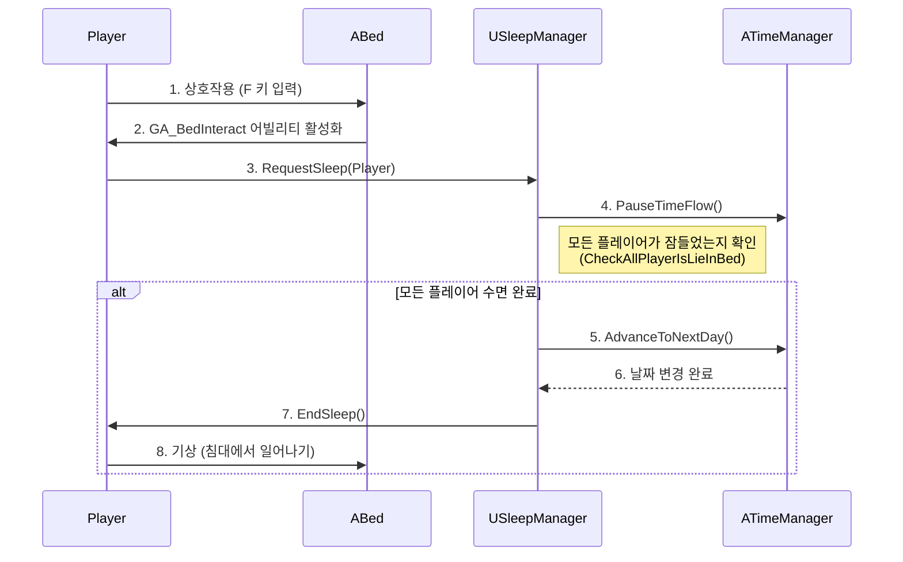
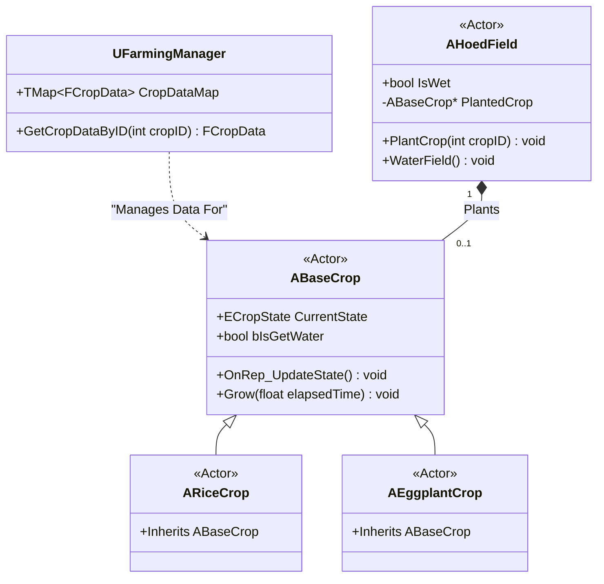
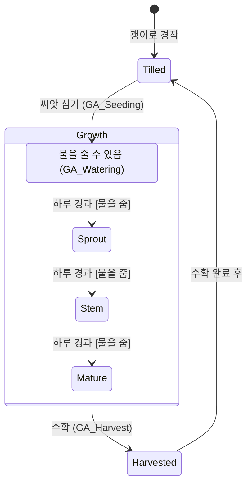
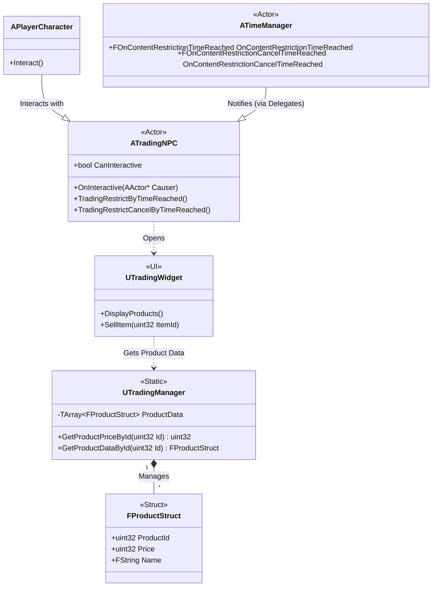
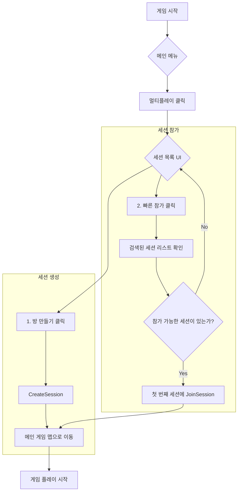

# ProjectISG
## 1. 프로젝트 개요

**ProjectISG**는 언리얼 엔진 5 기반의 멀티플레이어 농사 및 생활 시뮬레이션 게임입니다. 플레이어는 자신만의 공간을 꾸미고, 농작물을 재배하며, 다른 플레이어와 협력하여 커뮤니티를 발전시켜 나갑니다. 이 문서는 **제가** 이 프로젝트에서 설계하고 구현한 주요 기능들을 기술적인 관점에서 깊이 있게 설명하는 포트폴리오입니다.

---

## 2. 주요 기여 시스템

저는 게임의 핵심 플레이 루프를 구성하는 다음 시스템들을 책임지고 개발했습니다. 각 시스템을 설계할 때 멀티플레이 환경에서의 안정적인 동기화와 확장성을 최우선으로 고려했습니다.

- **시간 및 수면 시스템 (Time & Sleep System)**
- **농사 시스템 (Farming System)**
- **거래 시스템 (Trading System)**
- **로비 및 스팀 연동 시스템 (Lobby & Steam Integration)**

---

## 3. 시스템별 상세 분석

### 3.1. 시간 및 수면 시스템

게임 월드의 생동감과 플레이어의 생활 패턴을 구현하는 핵심 시스템입니다. `TimeManager`와 `SleepManager` 두 액터를 중심으로 유기적으로 동작하도록 설계했습니다.

#### **아키텍처 및 주요 기능**

- **`ATimeManager`**: 게임 내 모든 시간(초, 분, 시, 일, 계절)의 흐름을 관리하는 중앙 관리자 액터입니다.
  - **주야간 사이클**: 태양의 회전(`FRotator`)을 시간에 따라 동기화하여 사실적인 일출과 일몰을 구현했습니다.
  - **델리게이트 기반 이벤트 시스템**: `FOnContentRestrictionTimeReached`, `FAddSleepTimeToCrop` 등 특정 시간대에 도달하거나 상태가 변경될 때 델리게이트를 호출하여 다른 시스템(농사, 퀘스트 등)과의 결합도를 낮추고 유연한 상호작용을 구현했습니다.
  - **네트워크 동기화**: `CurrentTimeOfDay`, `Day`, `Hour` 등 핵심 시간 변수를 `Replicated`로 선언하여 모든 클라이언트에게 정확한 시간이 동기화되도록 보장했습니다.

- **`USleepManager`**: 플레이어의 수면 활동을 관리하는 액터 컴포넌트입니다.
  - **멀티플레이어 수면 동기화**: 모든 플레이어가 침대에 누워야만 시간이 빠르게 흐르고 다음 날로 넘어가는 로직을 구현했습니다. `CheckAllPlayerIsLieInBed` 함수를 통해 모든 플레이어의 상태를 확인하고, 서버에서 시간을 변경한 후 클라이언트에 동기화합니다.
  - **상호작용 및 시네마틱**: 플레이어가 `ABed` 액터와 상호작용하면 `SleepManager`가 이를 감지하여 수면 프로세스를 시작하도록 구현했으며, 수면 시 간단한 시네마틱을 재생하여 몰입감을 높였습니다.

#### **상호작용 시퀀스 다이어그램**

### 3.2. 농사 시스템

플레이어의 핵심 경제 활동인 농사를 구현한 시스템입니다. 데이터 기반 설계와 상태 패턴을 활용하여 효율적이고 확장 가능하게 구현했습니다.

#### **아키텍처 및 주요 기능**

- **`UFarmingManager` (정적 관리자)**: 모든 농작물의 데이터를 관리하는 정적 클래스입니다.
  - **데이터 기반 설계**: 농작물의 종류, 성장 기간, 획득 아이템 등의 정보를 데이터 테이블에서 로드하여 관리하도록 구현했습니다. 이를 통해 기획자가 코드를 직접 수정하지 않고도 새로운 작물을 쉽게 추가하거나 밸런스를 조정할 수 있습니다.
  - **효율적인 데이터 접근**: `TMap`을 사용하여 작물 ID 또는 아이템 ID로 농작물 데이터에 O(1) 시간 복잡도로 접근할 수 있도록 최적화했습니다.

- **`ABaseCrop` (농작물 액터)**: 개별 농작물 오브젝트를 나타내는 기본 클래스입니다.
  - **상태 패턴 (`ECropState`)**: 농작물의 상태를 `None`, `Seedling`, `Sprout`, `Stem`, `Mature` 등 명확한 열거형으로 정의하고, 각 상태에 따라 외형(메시)과 상호작용이 변화하도록 구현했습니다.
  - **물주기 및 성장**: `TimeManager`와 연동하여, 플레이어가 잠을 잘 때 성장 시간이 계산되도록 했습니다. 물을 준 상태(`bIsGetWater`)에서는 더 좋은 등급의 아이템을 수확할 확률이 높아지는 등 상호작용의 깊이를 더했습니다.
  - **네트워크 동기화**: `CurrentState` 변수가 변경될 때 `OnRep_UpdateState` 함수가 호출되어 모든 클라이언트에서 농작물의 외형이 실시간으로 변경되도록 구현했습니다.

#### **클래스 다이어그램**

#### **상태 다이어그램**

### 3.3. 거래 시스템 (Trading System)

게임 내 경제의 핵심 축을 담당하는 거래 시스템입니다. 플레이어가 이 시스템을 통해 농작물 등 자신의 아이템을 판매하고 재화를 얻을 수 있도록 구현했습니다.

#### **아키텍처 및 주요 기능**

- **`UTradingManager` (정적 관리자)**: 거래 가능한 모든 상품의 데이터를 관리하는 정적 클래스입니다.
  - **데이터 기반 설계**: `FProductStruct` 구조체를 기반으로 상품의 ID, 가격 등의 정보를 데이터 테이블에서 로드하여 관리합니다. 이를 통해 기획자는 코드 수정 없이 상품 목록과 가격을 손쉽게 변경하고 밸런싱할 수 있습니다.
  - **중앙 데이터 관리**: `GetProductPriceById`, `IsTradable`과 같은 정적 함수를 제공하여 게임 내 어디서든 상품 정보에 일관되게 접근할 수 있도록 설계했습니다.

- **`ATradingNPC` (상호작용 NPC)**: 플레이어가 거래를 시작하는 상호작용 지점입니다.
  - **시간 연동 거래 제한**: `TimeManager`의 시간대 변경 델리게이트(`FOnContentRestrictionTimeReached`)에 응답하여 특정 시간에는 거래가 불가능하도록 `CanInteractive` 플래그를 제어합니다. 이는 시스템 간의 직접적인 참조 없이 이벤트 기반으로 상호작용하는 좋은 예시입니다.
  - **상호작용 및 UI**: 플레이어가 `ATradingNPC`와 상호작용하면, 거래를 위한 UI를 열어주는 역할을 수행하도록 구현했습니다.

#### **클래스 다이어그램**

### 3.4. 로비 및 스팀(Steam) 연동 시스템

멀티플레이 게임의 기반이 되는 세션 관리 및 플레이어 연결을 담당하는 시스템입니다. 언리얼의 `Online Subsystem`을 활용하여 스팀(Steam)과의 연동을 구현했습니다.

#### **아키텍처 및 주요 기능**

- **`UISGGameInstance`**: 게임의 생명주기 동안 유지되는 `GameInstance` 클래스에 스팀 세션 관리 기능을 통합했습니다.
  - **세션 관리**: 스팀 `Online Subsystem`을 활용하여 게임 세션을 생성(`CreateSession`), 검색, 참여(`JoinFoundSession`)하는 기능을 구현했습니다.
  - **비동기 처리**: 세션 생성, 참여 등 네트워크 작업은 비동기적으로 처리되며, 완료 시 콜백(`OnCompleteCreate`, `OnJoinSession`)을 통해 결과를 받아 UI에 반영하거나 다음 동작을 수행하도록 구현했습니다.

- **`AMainGameMode`**: 로비 맵의 게임 모드로서, 플레이어의 접속을 처리하고 모든 플레이어가 준비되면 메인 게임 맵으로 이동(`ServerTravel`)시키는 역할을 담당합니다.

#### **세션 연결 플로우차트**

---

## 4. 총평 및 기술적 성과

저는 시간, 농사, 거래, 온라인 연동 등 게임의 근간을 이루는 핵심 시스템들을 성공적으로 구축했습니다. 특히 각 시스템을 설계할 때 **결합도 최소화**, **확장성**, **네트워크 안정성**이라는 세 가지 원칙을 일관되게 적용했습니다.

- **이벤트 기반 아키텍처**: 델리게이트를 적극적으로 사용하여 시스템 간의 의존성을 제거하고 유연한 구조를 만들었습니다.
- **데이터 기반 설계**: `FarmingManager`, `TradingManager`와 같이 데이터를 코드에서 분리하여 기획자의 작업 효율성을 높이고 유지보수를 용이하게 했습니다.
- **견고한 멀티플레이 구현**: 언리얼 엔진의 리플리케이션과 `Online Subsystem`에 대한 깊은 이해를 바탕으로 모든 기능이 멀티플레이 환경에서 원활하게 동작하도록 구현했습니다.

저의 이러한 노력은 `ProjectISG`가 단순한 기능의 집합이 아닌, 각 시스템이 유기적으로 연결되어 풍부한 플레이 경험을 제공하는 안정적인 게임으로 성장하는 데 핵심적인 역할을 했다고 생각합니다.
